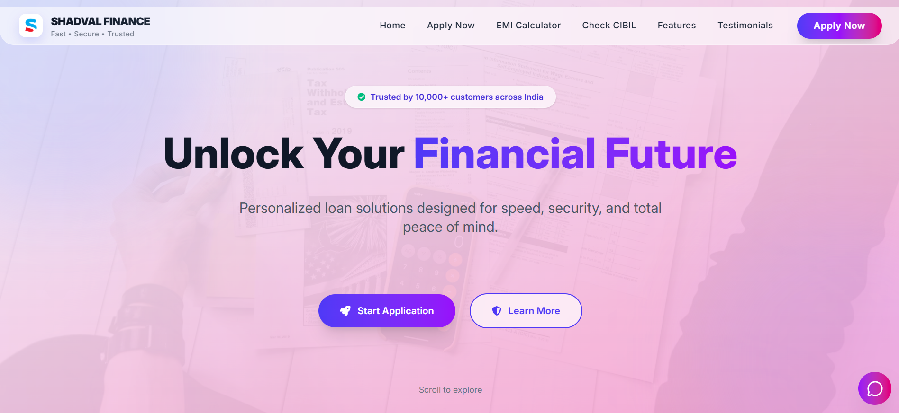
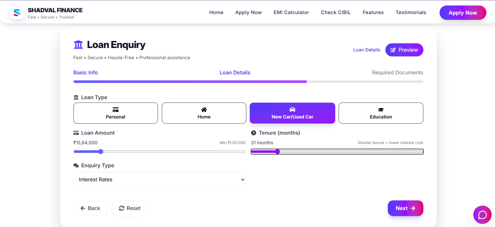
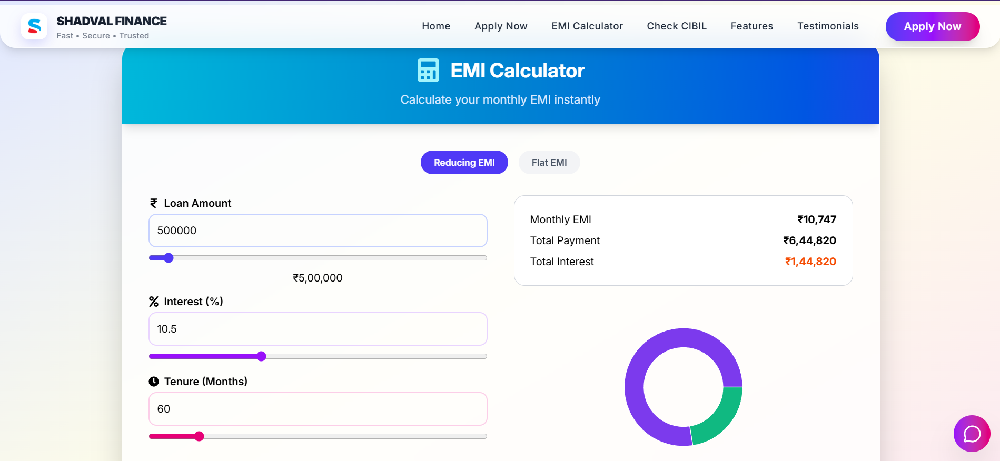
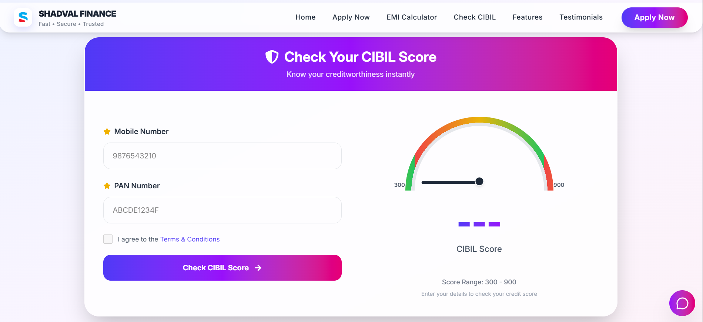
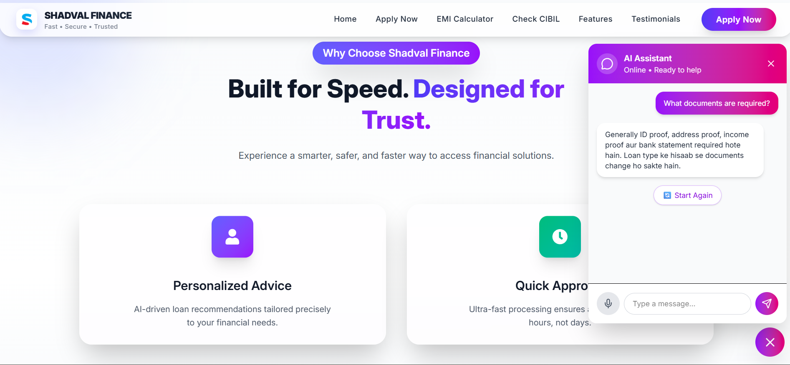

# Shadval Finance – Digital Loan Platform

[Visit Live Site](https://finance.shadvalpay.co.in/)

Shadval Finance is a secure and reliable digital loan platform that allows users to apply for personal and business loans quickly and seamlessly. The platform is designed to simplify the loan application process, track loan status, and provide a smooth experience for both borrowers and administrators.

Hosted on **Windows IIS Express**, the application provides a stable environment for testing and deployment.

---

## 🌟 Features

- **Online Loan Application** – Apply for loans directly from the platform.
- **Responsive Interface** – Works well across desktops, tablets, and mobile devices.
- **Secure & Reliable** – Built with best practices for data protection.

---

# 🖼️ Website Preview

## 🏠 Homepage


---

## 👨‍💻 Loan Enquiry Form


---

## 🛠 EMI Calculator


---

## 📂 Cibil Score Section


---

## 📂 Chatbot Section


---


## 🛠️ Tech Stack

| Layer        | Technology                     |
|--------------|--------------------------------|
| Frontend     | React / HTML, Tailwind_CSS, JavaScript  |
| Backend      | Node.js / Express / .NET (C#)  |
| Hosting      | Windows IIS Express            |
| Database     | SQL Server          |

---

## 💻 Setup Instructions

### **Prerequisites**
- Node.js & npm installed
- Windows OS
- Visual Studio (for IIS Express projects)
- SQL Server / LocalDB
- Git

The project has **two main directories**:

| Directory | Purpose                    |
|-----------|----------------------------|
| `server` | Server-side application    |
| `client`| Client-side application    |

---

### **Step 1: Clone Repository**
```bash
git clone https://github.com/Im-Rahul-Panchal/Shadval_Finance.git
cd Shadval_Finance
```

### **Step 2: Terminal Setup in VS Code**
Open Two Terminals - You need two separate terminals to run backend and frontend simultaneously 
| Terminal 1 → Backend | Terminal 2 → Frontend | 
|----------------------|------------------------------| 
| cd backend | cd frontend | 
| npm install | npm install | 
| npm start | npm start |

### **Step 3: Access the App**
Open your browser: http://localhost:5000

You should now see the full platform working.
